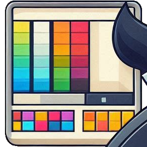
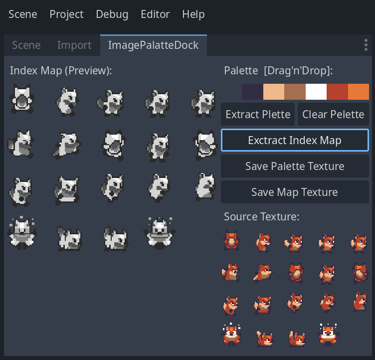

# h8Palette

Godot tools and shaders for palette swaps, palette animation and index maps

Based on https://github.com/h8man/unity-pixel-palettemap

Install via the [Asset Library](https://godotengine.org/asset-library/asset/3383)

## Instruction

- Open dock under `Editor > Editor Docks > Image Palette Dock`
- Double click on a Texture2D inside `FileSystem` for edit
- Drag and Drop you Texture2D palette anywhere on a Dock 
- Exctract Index Map and Save Index Map
- Create new Sahder Material of ImagePalette or ImagePaletteMap
- Use shader with FAB postfix if texture has `Fix Alpha Border`
- Supply Palette (optionaly Index Map) and apply material

Sprite sheets: https://ansimuz.itch.io/sunny-land-pixel-game-art

## Installation

If you've downloaded this manually, do the following:

- Ensure you're using **Godot 4.2 or above**
- Find the `addons` folder in your project files, or create it if it doesn't exist yet.
- Move the folder `addons/Godot.h8.Palette` to your project's `addons` folder.
- Enable Little Camera Preview under `Project > Project Settings > Plugins`

## Licence

Licensed under the MIT license, see [LICENSE](./LICENSE) for more information.
